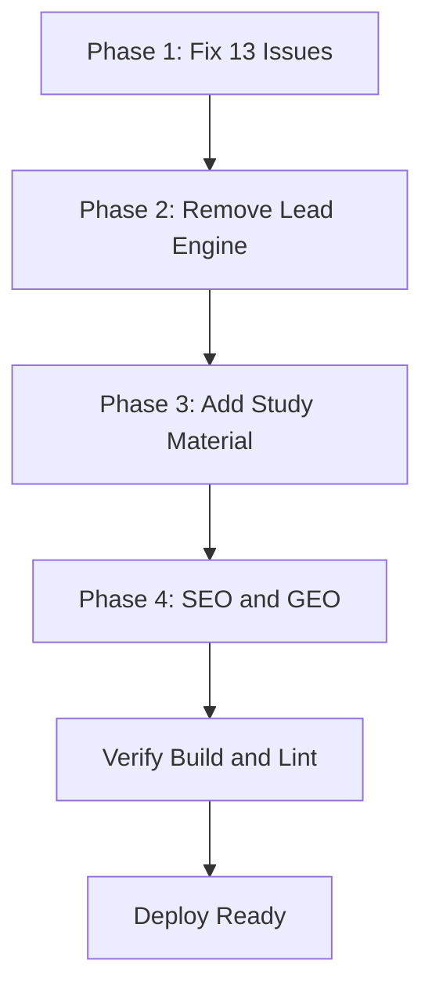

# Comprehensive Overhaul Plan — Kunwar Analytics

> **Goal:** Fix all 13 identified issues, remove the Lead Generation Engine entirely, add a new Study Material section (with category filters, search, and admin management), and make the site 100% SEO + GEO friendly — without downgrading the existing website.

---

## Execution Order & Dependency Map



**Why this order:** Phase 1 fixes the build so `tsc` passes. Phase 2 removes a large code surface (must happen before adding new features to avoid merge conflicts). Phase 3 adds the new feature. Phase 4 optimizes SEO/GEO across the whole site including the new section.

---

## PHASE 1 — Fix All 13 Issues

### 1.1 P0: Build-Breaking TypeScript Errors

#### Issue 1 — `PostWithAuthor` type mismatch
- **File:** `app/admin/cms/page.tsx:20`
- **Root cause:** `type PostWithAuthor = Post & { author: { name: string | null } }` expects the full `Post` model, but `prisma.post.findMany({ select: {...} })` returns a `Pick` shape.
- **Fix:** Replace the type definition with an inferred type from the Prisma query. Define the `select` object as a const, then use `Prisma.PostGetPayload<typeof select>` or `Awaited<ReturnType<...>>` for the type. Alternatively, use `include: { author: { select: { name: true } } }` instead of `select` so the return type is the full `Post` plus `author`.
- **Verification:** `npx tsc --noEmit` shows no error on this file.

#### Issue 2 — Prisma JSON null assignment in media-utils
- **File:** `lib/media-utils.ts:113`
- **Root cause:** `metadata: Object.keys(metadata).length > 0 ? metadata as any : undefined` — but the surrounding code passes `Record<string, unknown> | null` which Prisma rejects for JSON fields. Prisma needs `Prisma.JsonNull` for SQL NULL.
- **Fix:** Import `Prisma` from `@prisma/client`. Replace null/undefined handling: when metadata is empty, pass `Prisma.JsonNull`; when present, pass the object. Pattern:
  ```ts
  import { Prisma } from '@prisma/client'
  metadata: Object.keys(metadata).length > 0 ? metadata : Prisma.JsonNull
  ```
- **Verification:** `npx tsc --noEmit` shows no error on this file.

#### Issue 3 — `updatedAt` does not exist on `Media` type
- **File:** `lib/media-utils.ts:258`
- **Root cause:** The local `Media` interface (lines 8-27) lacks `updatedAt`, but code spreads a Prisma `Media` row (which also lacks `updatedAt` in the schema) into it. The error is at line 258 in `updateMediaMetadata` where `const returnedMedia: Media = { ...updated, ... }` — `updated` is a full Prisma `Media` which has no `updatedAt`, so this specific error may actually be about an extra property. Need to inspect exact line 258.
- **Fix:** Align the local `Media` interface with the Prisma `Media` model exactly. Either add `updatedAt?: Date` to both the schema and interface, or remove any reference to it. Since the Prisma `Media` model has no `updatedAt`, the fix is to ensure the spread doesn't include unexpected fields — use a explicit field mapping instead of spread.
- **Verification:** `npx tsc --noEmit` shows no error.

### 1.2 P1: Functional Runtime Bugs

#### Issue 4 — Missing `checkRole` export
- **File:** `actions/community-predictions.ts:6`
- **Root cause:** Error log says `Module '"@/lib/utils"' has no exported member 'checkRole'`, but the current file content shows line 6 is `import { revalidatePath } from "next/cache"`. This error may be **stale**.
- **Fix:** Run a fresh `npx tsc --noEmit` to confirm. If the error persists, search for `checkRole` usage and either add the export to `lib/utils.ts` or remove the import. If stale, no action needed.
- **Verification:** Fresh `tsc` output.

#### Issue 5 — `role`/`customBadge` missing on author type
- **File:** `app/predictions/PredictionsClient.tsx:33,34,134,208`
- **Root cause:** `PredictionWithAuthor` is inferred from `getAllPredictions()` in `lib/predictions.ts` which selects `author: { select: { id, name, email, role, customBadge } }`. The error suggests the type passed to `PredictionsClient` doesn't include `role`/`customBadge`. Need to check `app/predictions/page.tsx` to see if it uses a different query.
- **Fix:** Ensure `app/predictions/page.tsx` uses `getAllPredictions()` (or a query with the same `select` shape including `role` and `customBadge`). If it uses a custom query, add `role: true, customBadge: true` to the author select.
- **Verification:** `npx tsc --noEmit` shows no error on PredictionsClient.

### 1.3 P2: Code Quality & Security

#### Issue 6 — Auth debug mode in production
- **File:** `auth.ts:12`
- **Fix:** Change `debug: true` to `debug: process.env.NODE_ENV === 'development'`. Remove the "DO NOT REMOVE" comment.
- **Verification:** Production build no longer logs auth debug info.

#### Issue 7 — Pervasive `any` types
- **Files:** `app/admin/cms/page.tsx:39` (`const where: any`), `app/predictions/PredictionsClient.tsx:13` (`stats: any`), `lib/media-utils.ts:130` (`metadata as any`), and others.
- **Fix:** Replace `any` with proper Prisma types:
  - `const where: any` → `const where: Prisma.PostWhereInput`
  - `stats: any` → define a `PredictionStats` interface
  - `metadata as any` → `metadata as Prisma.InputJsonValue`
  - Audit all `as any` casts with a search and replace where safe.
- **Verification:** `npx tsc --noEmit` passes; reduced `any` count.

#### Issue 8 — `url.parse()` deprecation
- **Root cause:** Likely from `cheerio`, a scraper util, or `papaparse`. Need to trace with `node --trace-deprecation`.
- **Fix:** Run the build with `--trace-deprecation` to identify the source. If it's our code (e.g., in `lib/leads/scrapers/utils.ts`), replace `url.parse()` with `new URL()`. If it's a dependency, check for updates or suppress with a note.
- **Note:** Since we're removing the lead engine (Phase 2), the scraper code will be deleted anyway — this may auto-resolve.

#### Issue 9 — Edge runtime disabling SSG
- **Root cause:** A page/route declares `export const runtime = 'edge'`, forcing dynamic rendering.
- **Fix:** Search for `runtime = 'edge'` across the codebase. Remove or restrict to only middleware/auth routes that truly need it. Content pages should use Node.js runtime for SSG/ISR.
- **Verification:** Build output shows more `○` (Static) and fewer `ƒ` (Dynamic) routes.

### 1.4 P3: Architecture & Security

#### Issue 10 — Dual content system / Algolia sync gap
- **Root cause:** Algolia indexing (`scripts/algolia-index.ts`) only reads MDX files via `lib/content.ts`. DB-created posts (via CMS) are not indexed.
- **Fix:** Update `scripts/algolia-index.ts` to also fetch published posts from Prisma and index them. Add a `type` field to distinguish MDX vs DB content. Optionally, trigger re-indexing on post publish via a server action.
- **Verification:** Algolia index includes DB posts.

#### Issue 11 — No input validation
- **Fix:** Add `zod` (install if not present) and create validation schemas for:
  - `createCommunityPrediction` (claim min length, sector enum, valid date)
  - Lead API routes (will be removed in Phase 2, so skip)
  - Contact form, subscribe form, register route
- **Verification:** Invalid inputs return 400 with clear errors.

#### Issue 12 — No rate limiting on scrapers
- **Note:** The scraper endpoints will be **removed in Phase 2** along with the lead engine. No fix needed — deletion resolves this.

#### Issue 13 — `.env` possibly committed
- **Fix:** Check `.gitignore` for `.env` and `.env.local`. If missing, add them. Create `.env.example` with placeholder values (no secrets). If `.env` is already in git history, advise rotating secrets.
- **Verification:** `git status` shows `.env` as ignored; `.env.example` exists.

---

## PHASE 2 — Remove Lead Generation Engine Completely

### 2.1 Files to DELETE

**Admin pages (entire directory tree):**
- `app/admin/leads/` (all subdirectories and files)

**API routes (entire directory trees):**
- `app/api/leads/` (all subdirectories)
- `app/api/lists/` (all subdirectories)
- `app/api/scrape/` (all subdirectories)
- `app/api/enrich/` (all subdirectories)

**Library files:**
- `lib/leads/` (entire directory — scrapers, ai, dedup, scoring, parse, export, bulk-paste-parser)

**Components:**
- `components/admin/PipelineKanban.tsx`

**Scripts:**
- `scripts/test-scraper.ts`

**Data:**
- `data/leads-config.json`

**Docs:**
- `docs/lead-generation-engine.md`

### 2.2 Files to EDIT (remove lead references)

#### `components/admin/CollapsibleSidebar.tsx`
- Remove the menu item: `{ label: "Lead Engine", href: "/admin/leads", icon: Users, adminOnly: true }` (line 76)

#### `prisma/schema.prisma`
- Remove models: `Lead`, `ScrapeJob`, `LeadList`, `LeadListMember`, `LeadActivity`, `ImportLog`
- Remove enums: `LeadStatus`, `LeadSource`, `ScrapeType`, `JobStatus`, `ActivityType`
- **Important:** Check for any relations from other models to these (e.g., `User` model may reference leads). Remove dangling relations.
- **Migration:** Create a new Prisma migration to drop these tables. Run `npx prisma migrate dev --name remove-lead-engine`.

#### `package.json`
- Remove dependencies that are **only** used by the lead engine (verify usage first):
  - `@huggingface/inference` (only used in `lib/leads/ai/hf-client.ts`)
  - `cheerio` (only used in scrapers — verify no other usage)
  - `papaparse` / `@types/papaparse` (only used in CSV import — verify)
  - `xlsx` (only used in lead export — verify)
  - `react-dropzone` (only used in lead import — verify)
  - `@dnd-kit/core` / `@dnd-kit/sortable` (only used in PipelineKanban — verify)
- **Keep** if used elsewhere. Run a usage search before removing.

#### `app/admin/leads/` references in other files
- Search for any imports or links to `/admin/leads` across the codebase and remove them.
- Check `app/admin/page.tsx` (admin dashboard) for lead stats/widgets.

### 2.3 Verification
- `npx tsc --noEmit` passes with no lead-related errors.
- `npm run build` succeeds.
- Admin sidebar no longer shows "Lead Engine".
- No dead links to `/admin/leads`.

---

## PHASE 3 — Add Study Material Section

### 3.1 Overview
A new public section for finance, business analytics, and research study materials. Features:
- Category-wise filtering (e.g., Finance, Business Analytics, Research Methods, Data Science, Economics)
- Full-text search
- Admin can add/edit/delete materials and manage categories dynamically

### 3.2 Data Model (Prisma Schema Additions)

```prisma
model StudyMaterial {
  id          String   @id @default(cuid())
  title       String
  slug        String   @unique
  description String
  content     String   // Markdown or rich text
  categoryId  String
  category    StudyCategory @relation(fields: [categoryId], references: [id], onDelete: Cascade)
  authorId    String
  author      User     @relation(fields: [authorId], references: [id])
  type        String   @default("ARTICLE") // ARTICLE, VIDEO, PDF, COURSE, NOTE
  difficulty  String   @default("BEGINNER") // BEGINNER, INTERMEDIATE, ADVANCED
  tags        String[] @default([])
  coverImage  String?
  resourceUrl String?  // External link to PDF, video, etc.
  duration    Int?     // Estimated minutes
  published   Boolean  @default(false)
  featured    Boolean  @default(false)
  viewCount   Int      @default(0)
  publishedAt DateTime?
  createdAt   DateTime @default(now())
  updatedAt   DateTime @updatedAt

  @@index([categoryId])
  @@index([published])
  @@index([slug])
  @@index([type])
  @@index([difficulty])
}

model StudyCategory {
  id          String   @id @default(cuid())
  name        String   @unique
  slug        String   @unique
  description String?
  icon        String?  // Emoji or icon name
  color       String?  // Theme color
  order       Int      @default(0)
  createdAt   DateTime @default(now())
  updatedAt   DateTime @updatedAt

  materials   StudyMaterial[]

  @@index([slug])
  @@index([order])
}
```

- Add `StudyMaterial[]` relation to `User` model.
- Run `npx prisma migrate dev --name add-study-material`.

### 3.3 Public Pages

#### `app/study/page.tsx` — Study Material Listing
- Server component
- Fetches published materials + categories from Prisma
- Passes to client component for filtering/search
- SEO metadata: title, description, openGraph

#### `app/study/StudyClient.tsx` — Client Component
- Category filter chips (fetched from DB, dynamic)
- Search input (client-side filtering or Algolia-powered)
- Difficulty filter
- Type filter (Article, Video, PDF, Course)
- Sort options (Newest, Popular, Featured)
- Responsive grid of material cards
- Pagination or infinite scroll

#### `app/study/[slug]/page.tsx` — Individual Material
- Server component
- Fetches material by slug, increments view count
- Renders markdown content via `next-mdx-remote`
- Related materials sidebar
- SEO metadata + JSON-LD structured data (Article schema)

#### `app/study/category/[slug]/page.tsx` — Category Page (optional)
- Lists all materials in a category
- SEO-optimized category landing page

### 3.4 Admin Pages

#### `app/admin/study/page.tsx` — Study Material Management
- Table of all materials (published + drafts)
- Filter by category, type, status
- Create / Edit / Delete actions
- Links to editor

#### `app/admin/study/new/page.tsx` — Create New Material
- Form with title, description, content (TipTap editor or markdown), category select, type, difficulty, tags, cover image, resource URL
- Uses existing media library for image uploads

#### `app/admin/study/edit/[id]/page.tsx` — Edit Material
- Same form, pre-filled

#### `app/admin/study/categories/page.tsx` — Category Management
- CRUD for categories (add, edit, delete, reorder)
- Admin can add new categories dynamically (as requested)
- Set icon, color, description

### 3.5 API Routes

#### `app/api/study/route.ts`
- `GET` — list published materials (public, with filters)
- `POST` — create material (admin only)

#### `app/api/study/[id]/route.ts`
- `GET` — single material
- `PATCH` — update (admin only)
- `DELETE` — delete (admin only)

#### `app/api/study/categories/route.ts`
- `GET` — list categories (public)
- `POST` — create category (admin only)

#### `app/api/study/categories/[id]/route.ts`
- `PATCH` — update category (admin only)
- `DELETE` — delete category (admin only)

### 3.6 Server Actions
- `actions/study-actions.ts` — create/update/delete materials and categories (using `"use server"`)

### 3.7 Components
- `components/study/StudyCard.tsx` — material card
- `components/study/StudyGrid.tsx` — responsive grid
- `components/study/StudySearch.tsx` — search + filter bar
- `components/study/CategoryFilter.tsx` — category chips

### 3.8 Navigation Updates
- **Navbar:** Add "Study" to `mainLinks` array in `components/layout/Navbar.tsx`
- **Admin Sidebar:** Add "Study Material" menu item in `components/admin/CollapsibleSidebar.tsx`
- **Footer:** Add Study link if footer has navigation

### 3.9 Algolia Integration
- Update `scripts/algolia-index.ts` to index published study materials
- Add study materials to the Algolia search index with `type: 'study'`

### 3.10 Seed Data
- Create `prisma/seed-study-categories.ts` to seed initial categories:
  - Finance
  - Business Analytics
  - Research Methods
  - Data Science
  - Economics
  - Investment Analysis

---

## PHASE 4 — Full SEO + GEO Optimization

### 4.1 Technical SEO

#### Sitemap (`app/sitemap.ts`)
- Add study material pages (listing + individual slugs + category pages)
- Add case studies, podcast episodes, data-lab projects (currently missing)
- Add predictions page
- Use DB `publishedAt` for `lastModified` where available
- Add `alternates` for hreflang if multi-language planned

#### Robots (`app/robots.ts`)
- Already disallows `/api/`, `/_next/`, `/admin/` — good
- Add `/study/search` if there's a search results page (avoid indexing search results)
- Confirm sitemap URL is correct

#### Metadata — Per Page
- Audit every page for `export const metadata: Metadata`
- Ensure each has: `title`, `description`, `openGraph`, `twitter`, `alternates.canonical`
- Add `keywords` where relevant (though Google ignores them, other engines use them)

#### Structured Data (JSON-LD)
- **Article schema** on research, insights, study material pages
- **BreadcrumbList** on all nested pages
- **Organization schema** on home page
- **WebSite schema** with SearchAction on home page
- **Course schema** on study materials of type COURSE
- **FAQPage schema** where applicable
- Create `components/seo/JsonLd.tsx` reusable component

#### Canonical URLs
- Add `alternates: { canonical: \`https://kunwaranalytics.in${pathname}\` }` to all page metadata

### 4.2 GEO (Generative Engine Optimization)

GEO optimizes content for AI/LLM answer engines (ChatGPT, Perplexity, Google AI Overviews).

#### Content Structure
- Add **TL;DR / Key Takeaways** section at the top of each article (AI engines extract these)
- Use **question-based headings** (H2/H3 as questions) — e.g., "What is Quick Commerce Unit Economics?"
- Add **definition boxes** for key terms (AI engines love definitional content)
- Include **statistics with citations** in structured format

#### Semantic HTML & Machine-Readability
- Use proper heading hierarchy (H1 → H2 → H3, no skips)
- Add `data-*` attributes for machine-readable facts where appropriate
- Ensure content is in semantic `<article>`, `<section>`, `<aside>` tags

#### llms.txt File
- Create `public/llms.txt` — a standardized file for LLM crawlers describing the site, its content, and policies
- Format: title, description, list of key pages with summaries

#### AI-Friendly Metadata
- Add `meta name="description"` with concise, factual summaries
- Add OpenGraph article tags: `article:published_time`, `article:author`, `article:section`, `article:tag`
- Add `meta name="robots"` with `max-image-preview:large` for rich AI results

#### Schema.org Enhancements
- Add `about` and `mentions` properties to Article schema (links entities to Wikipedia/Wikidata)
- Add `author` with `Person` schema and `sameAs` linking to LinkedIn/Twitter
- Add `publisher` with `Organization` schema

### 4.3 Performance SEO
- Audit image usage — ensure all images use `next/image` with proper `alt` text
- Add `loading="lazy"` to below-fold images
- Ensure fonts are preloaded (already done in layout.tsx)
- Verify Core Web Vitals: LCP < 2.5s, CLS < 0.1, INP < 200ms

### 4.4 Local/Regional SEO
- Already has `locale: 'en_IN'` in metadata — good
- Add `geo` meta tags for India targeting:
  ```html
  <meta name="geo.region" content="IN" />
  <meta name="geo.placename" content="India" />
  ```
- Ensure `hreflang` is set if expanding to other languages

### 4.5 Files to Create/Modify
- `app/sitemap.ts` — expand with all content types
- `app/robots.ts` — minor updates
- `components/seo/JsonLd.tsx` — new reusable JSON-LD component
- `public/llms.txt` — new
- `app/layout.tsx` — add geo meta tags, Organization JSON-LD
- `app/page.tsx` — add WebSite + SearchAction JSON-LD
- All content pages — add Article JSON-LD, canonical URLs, enhanced metadata
- `app/study/[slug]/page.tsx` — Article/Course JSON-LD

---

## VERIFICATION CHECKLIST

After all phases:
- [ ] `npx tsc --noEmit` passes with zero errors
- [ ] `npm run build` succeeds
- [ ] `npm run lint` passes
- [ ] No dead links (search for removed routes)
- [ ] Admin sidebar updated (no Lead Engine, has Study Material)
- [ ] Navbar updated (has Study link)
- [ ] Sitemap includes all public pages
- [ ] robots.txt correct
- [ ] JSON-LD validates on Google Rich Results Test
- [ ] llms.txt accessible at `/llms.txt`
- [ ] Algolia index includes study materials
- [ ] Prisma migration applied successfully
- [ ] No `any` types introduced in new code
- [ ] All new pages have proper metadata

---

## RISK MITIGATION

1. **Backup before schema changes** — the Prisma migration drops lead tables. Ensure data backup exists.
2. **Incremental commits** — each phase should be a separate commit for easy rollback.
3. **Build after each phase** — don't proceed to next phase if build fails.
4. **Dependency removal caution** — verify each npm package isn't used elsewhere before removing from package.json.
5. **No downgrades** — all existing pages (research, insights, tools, predictions, podcast, etc.) must continue to work identically.
