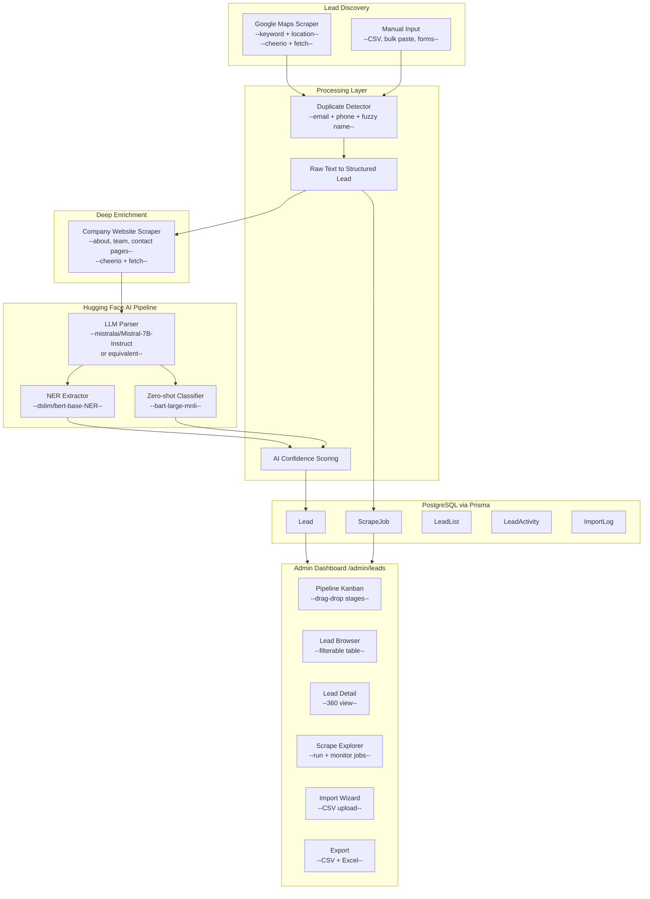
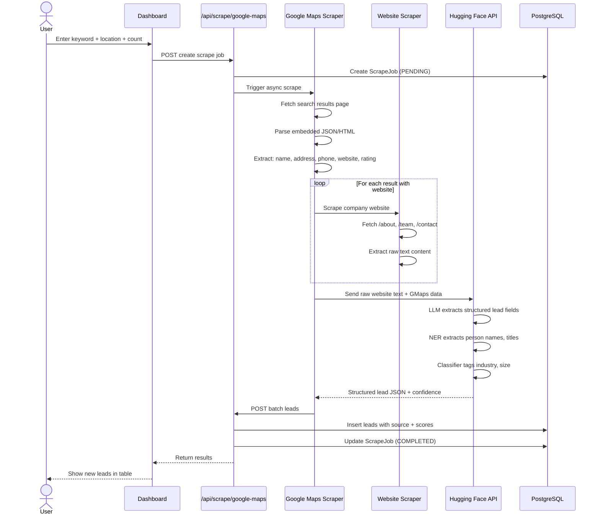
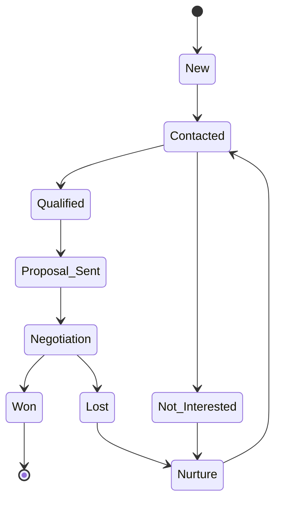

# FinNexus Lead Generation Engine — Final Architecture Plan

## Overview

A corporate-grade **Lead CRM + Discovery Engine** integrated into the FinNexus admin dashboard. Combines **server-side scrapers** (Google Maps + company websites) for lead discovery, **Hugging Face AI** for smart parsing/enrichment, and **manual tools** (CSV import, bulk paste, forms) for reliable data entry. Fully zero-cost beyond the free Hugging Face API tier.

---

## Architecture Diagram



## Data Flow: Google Maps → Structured Lead



## Lead Pipeline Kanban



---

## Database Schema (New Models)

### Lead

```prisma
model Lead {
  id              String     @id @default(cuid())

  // Personal
  firstName       String?
  lastName        String?
  fullName        String?
  jobTitle        String?
  department      String?
  seniority       String?

  // Company
  companyName     String?
  companyDomain   String?
  companySize     String?
  industry        String?
  companyLinkedIn String?
  website         String?

  // Contact
  emails          Json?
  phones          Json?
  linkedInUrl     String?
  twitterUrl      String?

  // Location (from Google Maps)
  address         String?
  city            String?
  state           String?
  country         String?
  postalCode      String?
  lat             Float?
  lng             Float?
  googlePlaceId   String?
  googleMapsUrl   String?

  // Pipeline
  status          LeadStatus @default(NEW)
  score           Int        @default(0)
  scoreBreakdown  Json?
  assignedTo      String?

  // Source attribution
  source          LeadSource @default(MANUAL)
  sourceData      Json?      // Raw data from source (GMaps JSON, scraped text, etc.)
  scrapeJobId     String?    // Links to ScrapeJob

  // AI enrichment
  aiEnriched      Boolean    @default(false)
  aiConfidence    Float?     // 0-1 from Hugging Face
  aiModel         String?    // Which HF model was used
  aiRawResponse   Json?      // Full HF response for debugging

  // Metadata
  tags            String[]   @default([])
  notes           String?
  customFields    Json?

  // Relations
  activities      LeadActivity[]
  listMemberships LeadListMember[]
  scrapeJob       ScrapeJob?  @relation(fields: [scrapeJobId], references: [id])

  // Timestamps
  createdAt       DateTime   @default(now())
  updatedAt       DateTime   @updatedAt

  @@index([status])
  @@index([score])
  @@index([source])
  @@index([companyName])
  @@index([industry])
  @@index([city, state])
  @@index([scrapeJobId])
  @@index([createdAt])
}
```

### ScrapeJob

```prisma
model ScrapeJob {
  id              String       @id @default(cuid())
  type            ScrapeType   // GOOGLE_MAPS, WEBSITE, BOTH
  status          JobStatus    @default(PENDING)

  // Google Maps params
  searchKeyword   String?      // e.g., "coffee shops"
  searchLocation  String?      // e.g., "Mumbai, India"
  searchRadius    Int?         // km
  maxResults      Int          @default(20)

  // Website scraping params
  domains         String[]     @default([]) // If type=WEBSITE

  // Results
  totalFound      Int          @default(0)
  totalScraped    Int          @default(0)
  totalEnriched   Int          @default(0)
  totalImported   Int          @default(0)
  totalSkipped    Int          @default(0) // Duplicates
  errors          Json?        // [{ step, message, url }]

  // Timing
  startedAt       DateTime?
  completedAt     DateTime?
  durationMs      Int?

  // User
  createdBy       String?      // User ID
  leads           Lead[]

  createdAt       DateTime     @default(now())
  updatedAt       DateTime     @updatedAt

  @@index([status])
  @@index([type])
  @@index([createdAt])
}
```

### LeadList

```prisma
model LeadList {
  id          String           @id @default(cuid())
  name        String
  description String?
  color       String?

  createdAt   DateTime         @default(now())
  updatedAt   DateTime         @updatedAt

  members     LeadListMember[]

  @@index([name])
}
```

### LeadListMember

```prisma
model LeadListMember {
  id      String   @id @default(cuid())
  listId  String
  list    LeadList @relation(fields: [listId], references: [id], onDelete: Cascade)
  leadId  String
  lead    Lead     @relation(fields: [leadId], references: [id], onDelete: Cascade)
  addedAt DateTime @default(now())

  @@unique([listId, leadId])
  @@index([listId])
}
```

### LeadActivity

```prisma
model LeadActivity {
  id        String        @id @default(cuid())
  leadId    String
  lead      Lead          @relation(fields: [leadId], references: [id], onDelete: Cascade)
  type      ActivityType
  summary   String?
  metadata  Json?
  userId    String?

  createdAt DateTime      @default(now())

  @@index([leadId, createdAt])
  @@index([type])
}
```

### ImportLog

```prisma
model ImportLog {
  id            String    @id @default(cuid())
  fileName      String
  fileSize      Int?
  totalRows     Int
  importedRows  Int       @default(0)
  skippedRows   Int       @default(0)
  errorRows     Int       @default(0)
  columnMapping Json
  errors        Json?
  status        String    @default("PROCESSING")
  userId        String?

  createdAt     DateTime  @default(now())

  @@index([userId])
  @@index([createdAt])
}
```

### Enums

```prisma
enum LeadStatus {
  NEW
  CONTACTED
  QUALIFIED
  PROPOSAL_SENT
  NEGOTIATION
  WON
  LOST
  NOT_INTERESTED
  NURTURE
}

enum LeadSource {
  GOOGLE_MAPS
  WEBSITE_SCRAPE
  CSV_IMPORT
  MANUAL
  BULK_PASTE
  WEB_FORM
}

enum ScrapeType {
  GOOGLE_MAPS
  WEBSITE
  BOTH
}

enum JobStatus {
  PENDING
  RUNNING
  SCRAPING_GMAPS
  SCRAPING_WEBSITES
  ENRICHING_AI
  COMPLETED
  PARTIAL
  FAILED
  CANCELLED
}

enum ActivityType {
  CREATED
  IMPORTED
  SCRAPED
  AI_ENRICHED
  STATUS_CHANGE
  NOTE_ADDED
  FIELD_UPDATED
  ADDED_TO_LIST
  REMOVED_FROM_LIST
  EXPORTED
  ASSIGNED
  BULK_UPDATED
  SCORE_CHANGE
}
```

---

## Hugging Face AI Pipeline

### Model Configuration

| Use Case | Model | Purpose |
|---|---|---|
| **Primary Parser** | `mistralai/Mistral-7B-Instruct-v0.3` | Parse raw scraped text into structured lead JSON |
| **NER Extractor** | `dslim/bert-base-NER` | Extract person names, orgs, locations from about/team pages |
| **Classifier** | `facebook/bart-large-mnli` | Zero-shot: classify industry, company size, seniority |
| **Fallback** | `google/flan-t5-base` | Lighter model if Mistral rate-limited |

### How It Works

**Step 1: Raw Text Collection**
- Google Maps scraper returns: `{ name, address, phone, website, rating, category }`
- Website scraper fetches homepage + /about + /team + /contact pages
- All text concatenated with source labels

**Step 2: LLM Structured Extraction (Primary)**
```
Prompt to Mistral-7B:
"You are a lead data extractor. Given raw text about a business, extract structured fields.
Return ONLY valid JSON.

Raw Text:
[GMAPS] Name: Blue Bottle Coffee, Address: 123 Main St, Mumbai
[WEBSITE-ABOUT] Founded in 2015, we serve specialty coffee...
[WEBSITE-TEAM] CEO: Rajesh Kumar, CTO: Priya Sharma...

Output JSON with these fields:
{
  companyName, industry, companySize, description,
  contacts: [{ firstName, lastName, jobTitle, email, phone }],
  address: { street, city, state, country, postalCode },
  confidence: 0-1
}"
```

**Step 3: NER Validation (Secondary)**
- Run BERT-NER on team/about text to cross-validate names/job titles
- If LLM missed a person that NER found, add it with lower confidence

**Step 4: Classification (Tertiary)**
- Run zero-shot classifier to tag industry and company size from text
- Compares against predefined labels: `["Technology", "Finance", "Retail", "Healthcare", "Manufacturing", "Consulting", "Real Estate", "Education"]`

**Step 5: Confidence Scoring**
- Combined confidence from LLM self-score + NER overlap + classifier score
- Displayed as: 🔥 High (0.8+), 🟡 Medium (0.5-0.79), 🔵 Low (<0.5)
- Low confidence leads are flagged for manual review

---

## Scraper Implementation Details

### Google Maps Scraper

Using `cheerio` + native `fetch`:

```
Strategy:
1. Fetch: https://www.google.com/maps/search/{keyword}+{location}/
2. Google Maps renders initial data in a script tag: window.APP_INITIALIZATION_STATE
3. Extract embedded JSON with regex
4. Parse JSON tree to find business listing results
5. Fallback: If JSON extraction fails, parse visible HTML with cheerio

Safety measures:
- Rotate User-Agent from a pool of 5-10 real browser agents
- 3-5 second delay between requests
- Max 20 results per job (paginated with delays)
- Detect CAPTCHA/block page and stop gracefully
- All errors logged to ScrapeJob.errors
```

Key library: [`lib/leads/scrapers/google-maps.ts`](lib/leads/scrapers/google-maps.ts)

### Company Website Scraper

Using `cheerio` + native `fetch`:

```
Strategy:
1. Given a domain, fetch: homepage, /about, /about-us, /team, /contact, /contact-us
2. For each page, extract:
   - All visible text (body.innerText)
   - Meta description and title
   - Schema.org structured data (JSON-LD)
   - Email patterns (regex: /[a-zA-Z0-9._%+-]+@[a-zA-Z0-9.-]+\.[a-zA-Z]{2,}/g)
   - Phone patterns (regex for international formats)
3. Combine into structured raw text with page source labels

Safety:
- 30-second timeout per domain
- 2-second delay between page fetches
- Max 5 pages per domain
- Respect robots.txt (basic check)
```

Key library: [`lib/leads/scrapers/website.ts`](lib/leads/scrapers/website.ts)

---

## API Routes

| Route | Method | Purpose |
|---|---|---|
| `/api/leads` | GET | List leads (paginated, filtered, sorted) |
| `/api/leads` | POST | Create single lead manually |
| `/api/leads/[id]` | GET | Lead detail + activity timeline |
| `/api/leads/[id]` | PATCH | Update lead (auto-recalculates score) |
| `/api/leads/[id]` | DELETE | Soft-delete lead |
| `/api/leads/import` | POST | Upload CSV, return preview with detected mappings |
| `/api/leads/import/confirm` | POST | Execute CSV import |
| `/api/leads/bulk` | PATCH | Bulk update (status, tags, assign, list) |
| `/api/leads/export` | POST | Export filtered leads as CSV/Excel |
| `/api/leads/[id]/activity` | GET | Activity timeline |
| `/api/leads/stats` | GET | Dashboard stats (by status, source, score) |
| `/api/lists` | GET/POST | List/create lead lists |
| `/api/lists/[id]` | GET/PATCH/DELETE | Manage a list |
| `/api/lists/[id]/leads` | POST/DELETE | Add/remove leads |
| `/api/scrape/google-maps` | POST | Create GMaps scrape job |
| `/api/scrape/google-maps/[jobId]` | GET | Get job status + results |
| `/api/scrape/website` | POST | Create website-only scrape job |
| `/api/scrape/website/[jobId]` | GET | Get job status + results |
| `/api/scrape/[jobId]/cancel` | POST | Cancel running scrape job |
| `/api/enrich/ai` | POST | Run HF AI enrichment on existing leads |
| `/api/enrich/ai/batch` | POST | Batch AI enrich multiple leads |

---

## Admin Dashboard Pages

| Page | Route | Purpose |
|---|---|---|
| **Lead Browser** | `/admin/leads` | Table + kanban toggle, filters, search, bulk actions |
| **Lead Detail** | `/admin/leads/[id]` | 360 view: fields, score, AI confidence, timeline |
| **New Lead** | `/admin/leads/new` | Full manual form |
| **Quick Add** | `/admin/leads/quick-add` | Minimal rapid entry |
| **Bulk Paste** | `/admin/leads/bulk-paste` | Clipboard table paste |
| **Import** | `/admin/leads/import` | CSV import wizard |
| **Import History** | `/admin/leads/imports` | Past import logs |
| **Google Maps Scraper** | `/admin/leads/scrape/maps` | Configure + run GMaps jobs |
| **Website Scraper** | `/admin/leads/scrape/website` | Configure + run website jobs |
| **Scrape Jobs** | `/admin/leads/scrape/jobs` | All jobs history + monitoring |
| **AI Enrichment** | `/admin/leads/enrich` | Run HF enrichment on selected leads |
| **Lists** | `/admin/leads/lists` | Manage lists |
| **List Detail** | `/admin/leads/lists/[id]` | View/edit list |
| **Export** | `/admin/leads/export` | Export config |

---

## Scrape Explorer UX

The Google Maps Scraper page provides a simple form:

```
┌─────────────────────────────────────────────┐
│  Google Maps Lead Discovery                  │
│                                              │
│  Keywords:  [________________]               │
│             e.g., "coffee shops, restaurants" │
│                                              │
│  Location:  [________________]               │
│             e.g., "Mumbai, Maharashtra"       │
│                                              │
│  Radius:    [20 km ▾]                        │
│                                              │
│  Max Results: [20 ▾]                         │
│                                              │
│  ☑ Also scrape company websites for details  │
│  ☑ Use AI to enrich scraped data             │
│                                              │
│  [ Start Discovery ]                         │
│                                              │
│  ⚠️ Scraping may take 1-3 minutes            │
│  depending on result count.                  │
└─────────────────────────────────────────────┘
```

While running, shows live progress:

```
┌─────────────────────────────────────────────┐
│  🔄 Scraping in progress...                  │
│                                              │
│  ▓▓▓▓▓▓▓▓▓▓▓▓▓▓░░░░░ 68%                    │
│                                              │
│  Found: 18 businesses                        │
│  Websites scraped: 12/18                     │
│  AI enriched: 8/18                           │
│  Imported: 8 leads (2 duplicates skipped)    │
│                                              │
│  Current: Scraping bluebottlecoffee.com      │
│  Elapsed: 1m 23s                             │
└─────────────────────────────────────────────┘
```

---

## Scoring Engine

Two-tier scoring:

### Tier 1: Data Completeness (primary, always calculated)
Same as before — percentage of fields filled:
- Contact Info (30%) + Personal Info (25%) + Company Info (25%) + Location (10%) + Extras (10%)

### Tier 2: AI Confidence (when available)
- If HF AI enriched the lead, incorporate the AI confidence score
- Final score = (Data Completeness * 0.6) + (AI Confidence * 100 * 0.4)
- AI-enriched leads get a "🤖 AI Enriched" badge

---

## File Structure

```
app/
  admin/
    leads/
      layout.tsx
      page.tsx                         # Lead Browser
      LeadBrowserClient.tsx
      LeadTable.tsx
      LeadKanbanBoard.tsx
      LeadFilters.tsx
      LeadBulkActions.tsx

      new/page.tsx                     # Manual entry
      quick-add/page.tsx               # Rapid entry
      bulk-paste/
        page.tsx
        BulkPasteClient.tsx

      import/
        page.tsx                       # CSV wizard
        ImportWizardClient.tsx
      imports/page.tsx                 # Import history

      scrape/
        maps/
          page.tsx                     # GMaps scraper form
          MapsScraperClient.tsx
        website/
          page.tsx                     # Website scraper form
          WebsiteScraperClient.tsx
        jobs/
          page.tsx                     # Job history
          JobsHistoryTable.tsx
          [jobId]/
            page.tsx                   # Single job detail
            JobDetailClient.tsx

      enrich/
        page.tsx                       # AI enrichment tool
        EnrichClient.tsx

      [id]/
        page.tsx                       # Lead detail
        LeadDetailClient.tsx
        LeadInfoPanel.tsx
        LeadScoreBadge.tsx
        LeadActivityTimeline.tsx
        LeadListMembership.tsx

      lists/
        page.tsx
        ListsGrid.tsx
        [id]/page.tsx
          ListDetailClient.tsx

      export/
        page.tsx
        ExportClient.tsx

  api/
    leads/
      route.ts                         # GET + POST
      [id]/
        route.ts                       # GET/PATCH/DELETE
        activity/route.ts
      import/route.ts
      import/confirm/route.ts
      bulk/route.ts
      export/route.ts
      stats/route.ts

    lists/
      route.ts
      [id]/
        route.ts
        leads/route.ts

    scrape/
      google-maps/
        route.ts                       # POST create job
        [jobId]/route.ts               # GET status
      website/
        route.ts
        [jobId]/route.ts
      [jobId]/
        cancel/route.ts

    enrich/
      ai/
        route.ts                       # POST single enrichment
        batch/route.ts                 # POST batch enrichment

lib/
  leads/
    scoring.ts                         # Completeness + AI confidence scorer
    dedup.ts                           # Duplicate detection
    export.ts                          # CSV/Excel builder
    parse.ts                           # CSV parser + column detection
    bulk-paste-parser.ts               # Clipboard parser

    scrapers/
      google-maps.ts                   # GMaps scraper
      website.ts                       # Company website scraper
      utils.ts                         # Shared: rotate UA, delays, fetch
      types.ts                         # Scraper interfaces

    ai/
      hf-client.ts                     # Hugging Face Inference client
      prompt-lead-extraction.ts        # Prompt templates for HF
      ner-extractor.ts                 # BERT-NER wrapper
      classifier.ts                    # Zero-shot classifier
```

---

## Dependencies to Add

```json
{
  "dependencies": {
    "cheerio": "^1.0.0",
    "@huggingface/inference": "^2.8.0",
    "papaparse": "^5.4.0",
    "xlsx": "^0.18.5",
    "@dnd-kit/core": "^6.1.0",
    "@dnd-kit/sortable": "^8.0.0"
  }
}
```

Environment variables:
```env
HUGGINGFACE_API_KEY=hf_your_key_here
```

---

## Key Design Decisions

1. **Scrapers run synchronously within API routes** (not background jobs). For small batches (10-30 results), this completes in 1-3 minutes, which is acceptable. The user sees live progress.

2. **Scraping is rate-limited and respectful**: 3-5s delays between Google Maps requests, 2s between website page fetches, rotating user agents, timeout handling.

3. **Google Maps data extraction**: Primary method is JSON extraction from embedded script tag. HTML parsing is fallback. If Google changes their page structure, the JSON approach is more resilient.

4. **Hugging Face models are configurable**: Users can swap the LLM model in env vars. Default is Mistral-7B which has a generous free tier.

5. **AI enrichment is optional**: Every scrape job can opt-in or out. Users can also retroactively AI-enrich manually imported leads.

6. **No browser/Puppeteer**: All scraping uses `cheerio` + `fetch` (server-side HTTP), following the "No Browser Rule".

7. **All sources coexist**: A lead can come from GMaps, manual entry, or CSV import. The system handles all uniformly in the same pipeline.