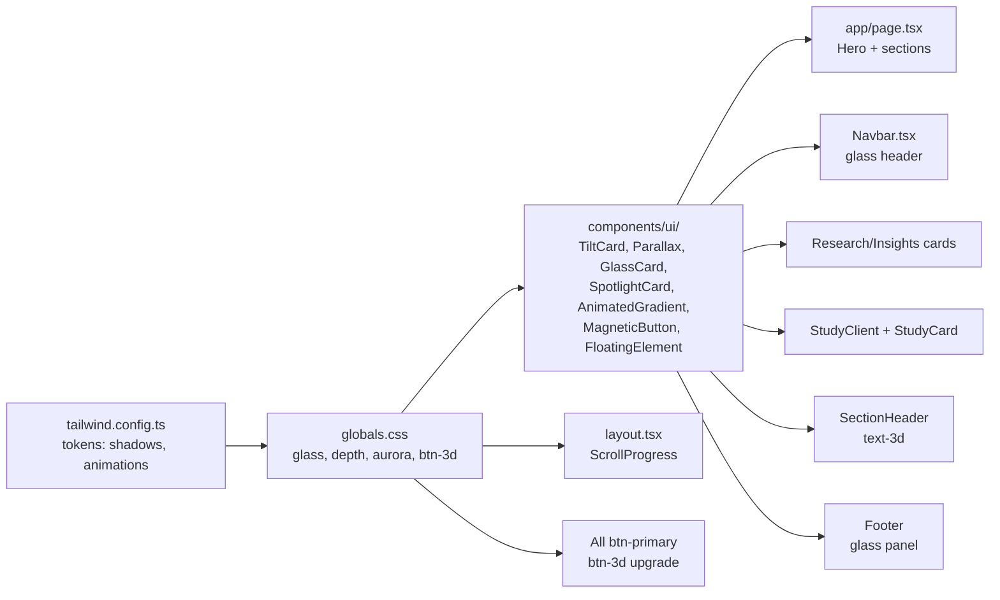

# Premium 3D Design Upgrade — Kunwar Analytics

> Goal: Transform the site into a "god-mode" premium 3D experience using **CSS 3D + lightweight JS only** (no WebGL/Three.js libraries). Fast, SEO-safe, accessible.

## Current State (Baseline)

| Asset | Status |
|-------|--------|
| Brand colors | navy `#1A2B3C`, slate, teal `#0D6E6E`, gold, green, red |
| Animations | `fadeInUp`, `fadeIn`, `shimmer`, `marquee` (basic) |
| Components | `ScrollReveal`, `HeroBackground` (static gradients), `SectionHeader` |
| Cards | `.card` (flat, hover lift `-4px`), `.research-card` (accent bar) |
| Glassmorphism | Only `.stat-card` uses `backdrop-blur-md` |
| 3D / Parallax | **None** |
| Shadows | Basic `shadow-md` / `shadow-lg` only |

## What "Premium 3D Accents" Means Here

1. **Glassmorphism** — frosted glass cards/panels with depth shadows + inner highlights
2. **3D card tilts** — mouse-tracking perspective transforms on cards
3. **Parallax** — scroll-driven depth movement on hero + section backgrounds
4. **Animated gradients** — aurora/mesh gradients that slowly shift
5. **Depth shadows** — multi-layer shadows for realistic elevation
6. **Spotlight glow** — radial glow that follows cursor on cards
7. **Magnetic buttons** — buttons that subtly pull toward cursor
8. **Floating elements** — subtle idle float animation
9. **3D text** — gradient text with layered depth
10. **Scroll progress** — 3D progress indicator

---

## Phase 1 — Design Token Foundation

### 1a. `tailwind.config.ts` — add tokens
- `boxShadow`: `depth-1` → `depth-4` (layered), `glow-teal`, `glow-gold`, `inner-highlight`
- `animation`: `float`, `glow-pulse`, `gradient-shift`, `aurora`, `shimmer-3d`
- `keyframes`: matching keyframe definitions
- `perspective` + `transformStyle` utilities via `extend`
- `backdropBlur`: extra levels (`xs`, `xl`)

### 1b. `app/globals.css` — add utility classes
- `.glass` — `backdrop-blur-xl bg-white/5 border border-white/10 shadow-depth-2` + inset highlight pseudo
- `.glass-dark` — darker variant
- `.depth-1` → `.depth-4` — shadow-only utilities
- `.glow-teal`, `.glow-gold` — colored glow shadows
- `.tilt-container` — `perspective: 1000px; transform-style: preserve-3d`
- `.aurora-bg` — animated mesh gradient (3 color stops, 20s loop)
- `.float-anim` — subtle Y-axis float (6s loop)
- `.text-3d` — layered gradient text with drop-shadow depth
- `.shimmer-border` — animated gradient border via mask
- Enhanced `.card` — add perspective + 3D hover (rotateX/Y on hover via group)
- `.btn-3d` — 3D pressable button (translateY on active, depth shadow)
- `@media (prefers-reduced-motion: reduce)` — disable all animations/transforms

---

## Phase 2 — Reusable 3D Component Library

All in `components/ui/`, all `"use client"`, all respect `prefers-reduced-motion`.

| Component | File | What it does |
|----------|------|--------------|
| `TiltCard` | `TiltCard.tsx` | Mouse-tracking 3D perspective tilt. Props: `maxTilt`, `scale`, `glare`. Uses `requestAnimationFrame`. |
| `Parallax` | `Parallax.tsx` | Scroll-driven Y-translate wrapper. Props: `speed`, `direction`. Uses `scroll` listener + rAF. |
| `GlassCard` | `GlassCard.tsx` | Glassmorphism card with depth shadow + optional spotlight. Server-safe wrapper (CSS-only). |
| `SpotlightCard` | `SpotlightCard.tsx` | Card with mouse-tracking radial glow overlay. |
| `AnimatedGradient` | `AnimatedGradient.tsx` | Aurora/mesh animated gradient background. Props: `colors`, `speed`. |
| `MagneticButton` | `MagneticButton.tsx` | Button that translates toward cursor on hover. Props: `strength`. |
| `FloatingElement` | `FloatingElement.tsx` | Wraps children with idle float animation. Props: `delay`, `distance`. |
| `ScrollProgress` | `ScrollProgress.tsx` | 3D gradient progress bar fixed at top. |

---

## Phase 3 — Apply Across Key Surfaces

### 3a. Homepage (`app/page.tsx`)
- Hero: replace static `HeroBackground` with `AnimatedGradient` (aurora) + `Parallax` layers
- Hero stat cards: wrap in `TiltCard` + `GlassCard`
- Hero buttons: `MagneticButton`
- Scroll indicator: `FloatingElement` + parallax
- Platform pillars grid: `TiltCard` + `SpotlightCard` on each pillar
- Trackers section: `GlassCard` cards
- CTA section: `AnimatedGradient` background + `MagneticButton`

### 3b. Navbar (`components/layout/Navbar.tsx`)
- Header: enhance glassmorphism (stronger blur + depth shadow + inset highlight)
- Dropdowns: glass panels with depth
- Nav links: subtle 3D hover (translateZ)

### 3c. Research / Insights cards
- Wrap cards in `TiltCard` + `SpotlightCard`
- Add `.shimmer-border` on featured cards

### 3d. Study section (`StudyClient.tsx`, `StudyCard.tsx`)
- Material cards: `TiltCard` + `GlassCard`
- Placement prep banner: `SpotlightCard` + `MagneticButton`

### 3e. Section headers (`SectionHeader.tsx`)
- Title: `.text-3d` gradient with depth
- Label: glow pulse

### 3f. Footer
- Glassmorphism panel
- `FloatingElement` on logo

### 3g. Global
- `ScrollProgress` bar in `app/layout.tsx`
- `.btn-3d` applied to all primary buttons via globals.css `.btn-primary` upgrade

---

## Phase 4 — Performance & Accessibility Guardrails

- All motion components check `window.matchMedia('(prefers-reduced-motion: reduce)')` and disable transforms
- Only use `transform` + `opacity` (GPU-composited) — never `width`/`top`/`margin`
- `TiltCard`/`SpotlightCard` use `requestAnimationFrame` + passive listeners
- `Parallax` uses passive scroll listener + rAF throttle
- No new npm dependencies (pure CSS + vanilla JS in client components)
- Lighthouse target: Performance ≥ 90, no CLS regression
- Dark mode: all new utilities have `.dark` variants

---

## Phase 5 — Verification

- `npx tsc --noEmit` → 0 errors
- `npx next build` → success
- Visual check: hero, cards, navbar, study, footer
- `prefers-reduced-motion` test: animations disabled
- Lighthouse spot-check

---

## Architecture Diagram

## File Impact Summary

| File | Action |
|------|--------|
| `tailwind.config.ts` | Edit — add shadows, animations, keyframes |
| `app/globals.css` | Edit — add ~15 utility classes + reduced-motion |
| `components/ui/TiltCard.tsx` | **New** |
| `components/ui/Parallax.tsx` | **New** |
| `components/ui/GlassCard.tsx` | **New** |
| `components/ui/SpotlightCard.tsx` | **New** |
| `components/ui/AnimatedGradient.tsx` | **New** |
| `components/ui/MagneticButton.tsx` | **New** |
| `components/ui/FloatingElement.tsx` | **New** |
| `components/ui/ScrollProgress.tsx` | **New** |
| `app/page.tsx` | Edit — apply 3D to hero + sections |
| `components/layout/Navbar.tsx` | Edit — glass header + 3D dropdowns |
| `components/ui/SectionHeader.tsx` | Edit — text-3d + glow |
| `components/ui/HeroBackground.tsx` | Edit — add animated layers |
| `components/study/StudyClient.tsx` | Edit — TiltCard on materials |
| `components/study/StudyCard.tsx` | Edit — wrap in TiltCard |
| `app/layout.tsx` | Edit — add ScrollProgress |
| Research/Insights card components | Edit — wrap in TiltCard/SpotlightCard |
| Footer component | Edit — glassmorphism |
